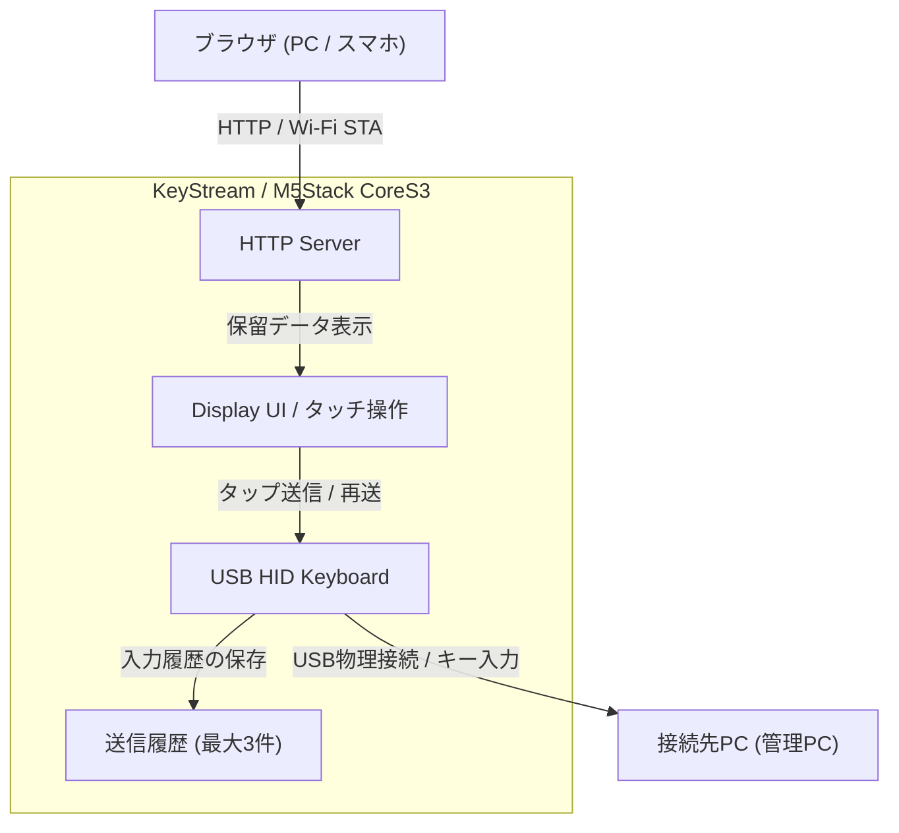
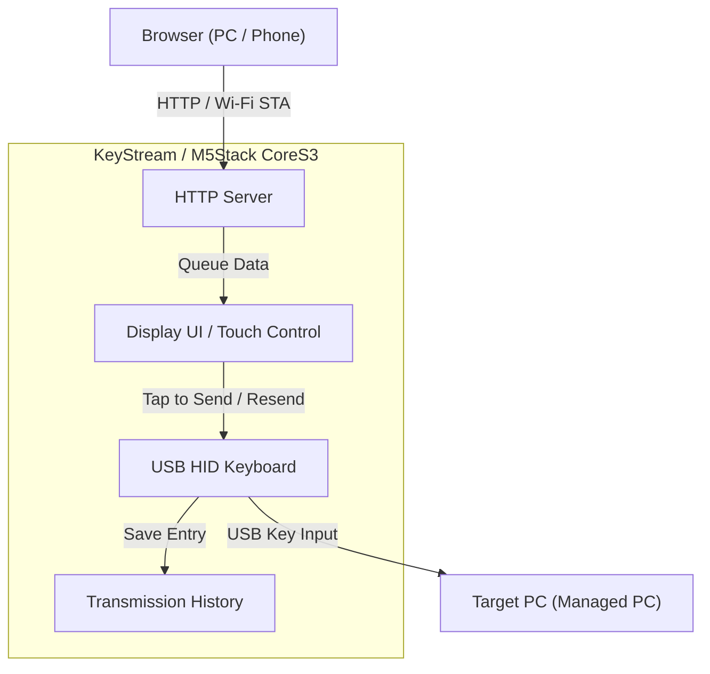

# KeyStream

> A secure Wi-Fi to USB HID Keyboard bridge for air-gapped and managed PCs.

日本語 | [English](#english)

---

# 日本語

## 概要

**KeyStream** は、Wi-Fi経由で受信したテキストを **USB HID Keyboard** として入力するためのM5Stack/ESP32-S3向けソフトウェアです。

USBメモリや独自デバイスドライバが利用できない管理PCに対して、OS標準のUSBキーボードとして動作することを目的としています。

本プロジェクトでは、安全性を重視し、

* 送信された内容を本体画面で確認
* 本体のタッチパネルを押した場合のみ入力
* 入力履歴を保持

という運用を前提としています。また、一気通貫で即時送信するモードも備えています。

---

## 主な機能

* **Wi-Fi経由でテキスト受信 (STAクライアントモード)**
* **USB HID Keyboardとして入力** (JIS/US配列を動的に自動マッピング)
* **近未来的警告色調のUI** (M5Stack CoreS3液晶画面)
  * Wi-Fi/USB状態の自前描画アイコン表示
  * 取得IPアドレスの被りなし表示
  * 文字数とバッファ内テキストのプレビュー表示
* **タッチパネルによる確認入力・再送操作**
  * 未送信データエリアをタップして入力を実行
  * 送信履歴エリア（直近3件）をタップして履歴から再送
  * 履歴再送時の重複排除機能（同じ内容を再送した場合は履歴スロットの先頭へ繰り上がるのみで、無駄にスロットを増やしません）
* **Webブラウザ送信UI (Web UI)**
  * PCからブラウザ経由で文字入力・配列選択が可能
  * 送信モード: `BUFFER ONLY` (本体保留) / `DIRECT SEND` (即時一気通貫入力)
  * リアルタイムのデバイスステータス（USBマウント、タイピング中など）の監視表示

---

## システム構成



---

## Wi-Fi設定方法

本デバイスが既存のWi-Fiネットワークにクライアントとして接続するための設定は、`src/wifi_credentials.h` で行います。
このファイルはローカル専用の情報であり、`.gitignore` に登録されているため、Gitでコミットされることはありません。

1. `src/wifi_credentials.h.template` をコピーして `src/wifi_credentials.h` を作成します。
2. 接続先の SSID とパスワードを書き込みます。

```cpp
#define WIFI_SSID "YOUR_SSID"
#define WIFI_PASS "YOUR_PASSWORD"
```

---

## Web UI（送信画面）の使い方

M5Stackと同じWi-Fiネットワーク内のPCから、以下のいずれかの方法で送信画面を開くことができます。

1. **ブラウザからIPアドレスに直接アクセス（推奨）**:
   液晶画面左上に表示されている IPアドレス（例: `http://192.168.x.x/`）にアクセスします。
2. **ローカルHTMLファイルを使用**:
   プロジェクトルートにある [web_ui.html](file:///Users/takuro/src/keystream/web_ui.html) をブラウザで直接開きます。画面上部の入力欄にM5StackのIPアドレスを設定してください。

### 送信モード：
* **BUFFER ONLY (保留送信)**: 文字列をM5Stack本体に転送し保留します。本体の液晶画面（`UNCONFIRMED DATA`）をタップすることで初めてPCにタイピング入力されます。
* **DIRECT SEND (即時送信)**: 本体のタップ操作を介さず、ブラウザから即座にPCへ一気通貫でタイピング入力されます。

---

## ファームウェアの書き込み方法（ダウンロードモード）

本デバイスはセキュリティ要件を満たすため、起動後にUSB CDC（仮想シリアルポート）を切断します。そのため、通常起動状態ではPCからシリアルポートが見えなくなります。
新しいプログラムを書き込む際には、手動で **ダウンロードモード（ブートローダーモード）** に切り替える必要があります。

### ダウンロードモードへの移行手順：
1. USBケーブルをPCから抜きます。
2. M5Stack CoreS3の左側面にある **「RST（リセット）」ボタンを約2秒間長押し** します。
3. 成功すると、本体内部のLEDが **緑色** に点灯し、画面が黒いまま書き込み待ち状態になります。
4. この状態でPCにUSB接続すると、再び書き込み用シリアルポート（`/dev/cu.usbmodem*` 等）が認識され、PlatformIO等のツールでファームウェアのアップロードが可能になります。

---

## 対応ハードウェア

* M5Stack CoreS3
* M5Stack CoreS3 SE

将来的には

* AtomS3
* StampS3

への対応も予定しています。

---

## 開発環境

* ESP-IDF (espressif32@6.6.0)
* TinyUSB
* M5Unified

---

## セキュリティポリシー

KeyStream は、管理PCでの利用を想定して設計されています。

そのためUSBデバイスとして公開するクラスは

* HID Keyboard

のみです。

以下は使用しません。

* USB Mass Storage
* USB CDC Serial (稼働時)
* WebUSB
* DFU
* Composite Device

OS標準ドライバのみで認識されることを目標としています。

---

## ライセンス

MIT License

---

# English

## Overview

**KeyStream** is a Wi-Fi to USB HID Keyboard bridge designed for M5Stack and ESP32-S3 devices.

It receives text over Wi-Fi and types it on a target computer as a standard USB keyboard.

The primary goal is to work with managed or security-restricted PCs where:

* USB storage devices are blocked
* Third-party drivers cannot be installed
* Only standard HID devices are allowed

---

## Features

* **Receive text over Wi-Fi (STA Client Mode)**
* **Type text as a USB HID Keyboard** (dynamic JIS/US auto-mapping)
* **Cockpit-style display UI with warnings tone** (M5Stack CoreS3 screen)
  * Custom graphic icons for Wi-Fi/USB status
  * Non-overlapping IP address display
  * Text character count and preview
* **Touch Panel Controls**
  * Tap unconfirmed data box to type to PC
  * Tap history slots (max 3 entries) to resend previous texts
  * Duplicate history prevention (resending moves the item to Slot 1 instead of cluttering the list)
* **Web UI (Transmitter Screen)**
  * Enter texts and select keyboard layouts from any browser
  * Send modes: `BUFFER ONLY` (queue on M5Stack) / `DIRECT SEND` (instant typing)
  * Real-time status indicators (USB connection, typing state)

---

## Architecture



---

## Wi-Fi Configuration

To configure the Wi-Fi client network settings, modify `src/wifi_credentials.h`. This file contains local credentials and is excluded from Git via `.gitignore`.

1. Copy `src/wifi_credentials.h.template` to `src/wifi_credentials.h`.
2. Enter your SSID and Password:

```cpp
#define WIFI_SSID "YOUR_SSID"
#define WIFI_PASS "YOUR_PASSWORD"
```

---

## How to Use Web UI

You can access the transmitter interface from any PC connected to the same Wi-Fi network using one of the following methods:

1. **Access Via IP Address (Recommended)**:
   Navigate to `http://【IP_ADDRESS】/` shown on the top-left of the M5Stack screen.
2. **Access Via Local HTML File**:
   Open [web_ui.html](file:///Users/takuro/src/keystream/web_ui.html) directly in your browser. Configure the M5Stack's IP address at the top input field.

### Transmission Modes:
* **BUFFER ONLY**: Transfers text to the M5Stack for queuing. You must tap the M5Stack screen (`UNCONFIRMED DATA`) to initiate typing.
* **DIRECT SEND**: Instantly types the text to the target PC without requiring any M5Stack screen confirmation.

---

## How to Flash Firmware (Download Mode)

For security compliance, this device disables the USB CDC (Virtual Serial Port) once the firmware boots. As a result, the serial port is not visible to the PC under normal operation.
To flash new firmware, you must manually put the device into **Download Mode (Bootloader Mode)**.

### Steps to Enter Download Mode:
1. Unplug the USB cable from the PC.
2. **Press and hold the "RST" (Reset) button** on the left side of the M5Stack CoreS3 for about **2 seconds**.
3. If successful, the internal LED will turn **green**, and the screen will remain black.
4. Plug the USB cable back into the PC. The serial port (e.g., `/dev/cu.usbmodem*`) will appear, allowing you to upload the firmware using PlatformIO.

---

## Hardware

Currently planned:

* M5Stack CoreS3
* M5Stack CoreS3 SE

Future support:

* AtomS3
* StampS3

---

## Software Stack

* ESP-IDF (espressif32@6.6.0)
* TinyUSB
* M5Unified

---

## Security

KeyStream intentionally exposes only a single USB interface:

* USB HID Keyboard

 the following USB classes are intentionally disabled during execution:

* USB Mass Storage
* USB CDC Serial
* WebUSB
* DFU
* Composite Devices

This minimizes compatibility issues with managed corporate environments.

---

## License

MIT License
